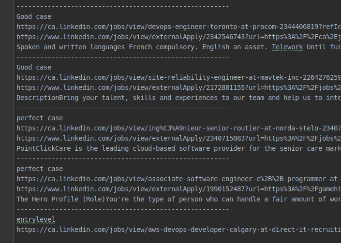

 I've been job hunting and I'm having a tough time. It's so bad that I only managed to apply for 2 jobs in the entire month. 
  
  For starters, the jobs that I'm interested are very scare. This may sound suprising to many. *Aren't Cloud jobs all the rage nowadays?* Yes they are but only for experienced cloud professionals or anyone with a moderate amount of experience in the industry. Otherwise, no they aren't in demand.  
  
 Second, I hate the emotional roller-coaster involved in scanning job postings. Picture this: You find the perfect job posting only to realize that that the final paragraph states they want want somone X amount of years of experience. Discouraging, right?  And mind you, this process ends up happening more than the  happy parts. 
 
 And finally, I'm just a lazy guy. I don't want to spend my time job hunting, I'd rather spend that time working on other projects like this one. 
 
 And so began my journey automating the job hunt.

Thankfully, I didn't have to write the scraper from scratch. The kind people on github already invented the wheel for me. By using their open-source scraper, I could easily scrape thousands of job-listings from the comfort of my terminal. The scraper also came with built-in search filters shown below: 

```py
    Query(
        query='Cloud Engineer',
        options=QueryOptions(
            locations=['Canada',"United-States"],
            optimize=False,
            limit=limit,
            filters=QueryFilters(
                relevance=RelevanceFilters.RECENT,
                time=TimeFilters.MONTH,
                experience=[ExperienceLevelFilters.INTERNSHIP, ExperienceLevelFilters.ASSOCIATE, ExperienceLevelFilters.ENTRY_LEVEL]
            )
        )
    ),
```
Unfortunately, the scraper's filters weren't very granular. I wanted a way to parse for specific keywords like languages, tools, skills,  whether the job was remote, etc. And to top it all off, I wanted a way exclude any job posting that contained more than 3 years of experience. As far as I'm aware, even Linkedin's advanced search doesn't  even offer such functionality. In order to accomplish my goal, I had to learn a very powerful skill: Enter Regex. 

Funny enough, I always tried to avoid regex at all costs. The weird and arcane symbols you see in regex expressions certainly didn't help the learning curve, but I was determined to learn it to solve my problem. It was hard at first, but I slowly realized that there was a language to it. Once you understood the language, regex became easier to digest. Also if you're curious, I used this godsend of a site to learn it. 

#### Learn a bit of regex!

 The following examples will contain an example regex used in the script. If you don't know Regex, don't fret. I'll do my best to walk you through the this regex expression:
 
 `r'\b(node(js)?|Typescript|javascript|python|bash)\b`

the `|` is called the [alternator](https://www.regular-expressions.info/alternation.html#:~:text=Alternation%20is%20similar.,of%20several%20possible%20regular%20expressions.&text=That%20is%2C%20it%20tells%20the,right%20of%20the%20vertical%20bar), but you can think of it as an `or` operator like in many programming languages. So the regex will try to match the job posting ad against all the characters in `Typescript or javascript or python or bash`. 
 
 The `node(js)?` is a bit special. The stuff in the parenthesis which is `(js)` is optional. This means that regex can match either `node or nodejs`. Putting it all together we get `node or nodejs or Typescript or javascript or python or bash` 
 
 The `\b` on either end of the regex expression denotes the word boundary. Remember how I said regex will match against all the characters in `Typescript or javascript or python or bash`? 
 
This means if you have say, "helloTypescriptworld", the regex will still match as the characters in the test string matched against all the characters in `Typescript`. If you used word boundaries, like `\bTypescript` then "Typescriptworld" would match. Likewise, `\bTypescript\b` will only match the word, "Typescript".

To drive the point home, check this [demo](https://regex101.com/r/KwngR1/4) out. 


#### The most powerful regex in the script

 Great, using the regex above, I could filter for specific keywords. But... I still needed a way to exclude out the job postings that required years of experience. For example, I needed a way to filter out, "10-15 years, 10+ years, 4 to 6 years, 10 or more years, and so on" If anything, If anything, I only wanted to find jobs that required 1-2 years of experience. 
 This is where regex truly shines: 
 
 `r"([3-9](?:-[3-9])?\+?)\s*(or more|to)?(years?)"`
 
 What the hell is that? Check this [demo](https://regex101.com/r/rEtVFR/1)  out.  The main idea behind that regex expression is that it searches for jobs that require 3-9 years of experience. But hang on! Why am I searching for jobs that require 3-9 years when I'm only interested in 1-2 years?! Well, assuming you still know set theory from CS, I plan to invert the set of all jobs with 3-9 years of experience to get the jobs with 1-2 years of experience. 
 
 Why would I go through that hassle? If I only searched for for jobs that required 1-2 years of experience, 1) I Wouldn't find jobs with 0 years of experience, or entry-level jobs that don't require any expereience whatsoever  and 2) I reduce my chances of of finding false positives. Picture a job posting that states "3-9 years in Terraform and 1-2 years in Docker", the regex will match with the 3-9 years and hence the listing won't be scraped. 
 
 
#### Job searching on steroids 
 
 Moving on, I built a script that assigns each filtered job-post a tag that denotes it's relevance. So any jobs with the "Perfect case" tag contain all the criteria that I want (Linux,AWS,Terraform,Nodejs, remote,etc), while the "Best case" tag may only contains jobs that hit most of the keywords in my criteria. 
 
 <figure>
 
 <figcaption>A picture of the output</figcaption>
 </figure>
 
####   Conclusion
 There are improvement to be made. For one, I don't want to see job postings that contain irrelevant keywords like, "Ruby, Graphql, Apachespark". A regex that excludes out irrelevant keywords would be very helpful in this sitaution. Next, the regex for exluding out years of experience could be further optimized and improved. 
 
 Other than that, it's a powerful tool. 
 
 You can find the repository here 
  https://github.com/kapooky/linkedin-scraper-script
 


 
 
 
 
 
 


